# World Rail Way Performance Analysis

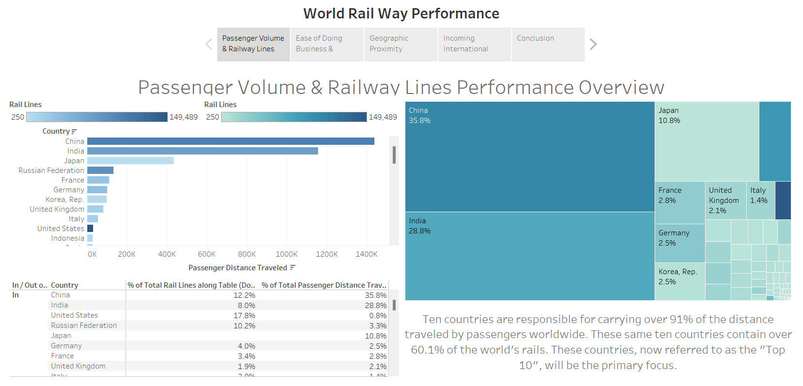

## Overview
In this project, the goal is to leverage data analysis to recommend the best country for launching a railway travel booking startup. As a newly hired data analyst, you have access to a dataset encompassing various country-specific metrics such as GDP, railway infrastructure details, ease of doing business score, and more. The analysis involves evaluating these factors to determine the most promising market for the new business. Key considerations include prioritizing a high GDP versus a favorable business environment, assessing the impact of existing railway infrastructure and usage, and understanding the significance of international visitors.

## Resource & Technologies Used

**Dataset**

Option 1: [Kaggle](https://www.kaggle.com/datasets?fileType=csv)

Option 2: And, also the dataset can be found on [Tableau](https://www.coursera.org/learn/communicating-data-insights-with-tableau) Coursera Course. I am grateful for his guidance on this project.

**Tools** 

Microsoft Excel, and Tableau.

## Data Analysis & Visualization 
### 1. Looking the highest priority is to identify countries that have a high passenger usage of existing railways. 

**Insight:** By observing China country leads with the greatest passenger distance traveled.

### 2. Finding which country ranks high in having a lot of existing railways but doesn't seem to be carrying very many passengers when considering the total length of existing railways.

**Insight:** United States country ranks high in having a lot of existing railways.

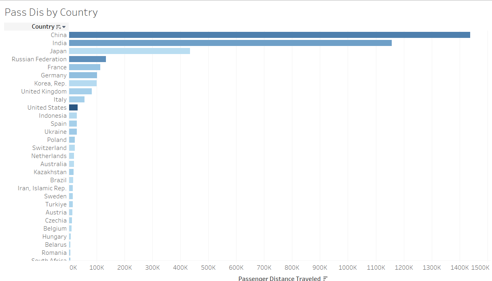

### 3. It might be interesting to see, out of the total distance traveled by passengers worldwide, how much has each country contributed to the total.

**Insight:** China's have highest percentage of the total passenger distance traveled which is 35.8% and the least contribution based on treemap are Spain, Ukraine, and Indonesia which is 0.7%.

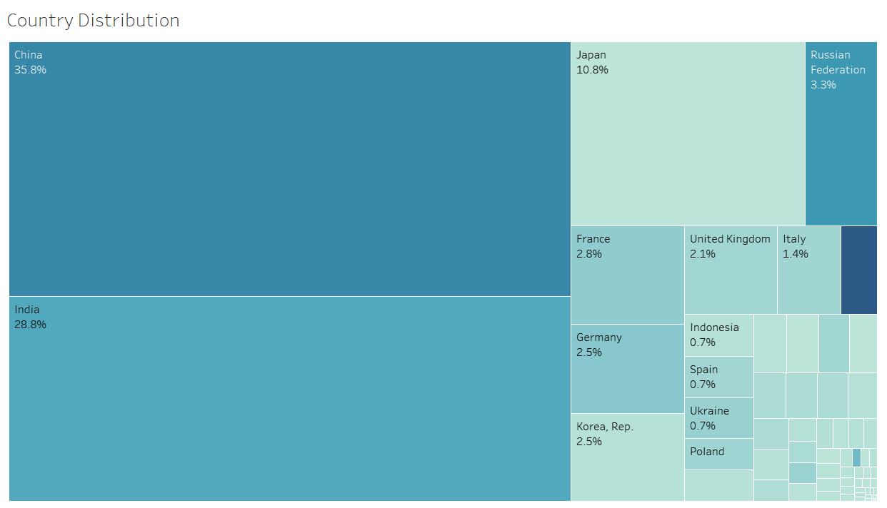

### 4. What percentage of the total passenger distance traveled & total railway length is from the top ten countries (countries that are "in" the set)? 

**Insight:** 91.0% is total passenger distance traveled and 60.1% of the total railway length from the top ten countries.

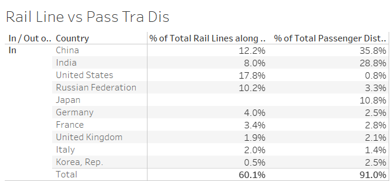

### 5. Looking for the countries that have a high GDP per capita AND ease of doing business score

**Insight:** Ease of doing business score and the GDP per Capita, Which can be found in the top-right corner of scatter plot and Our list has been narrowed down to six countries.

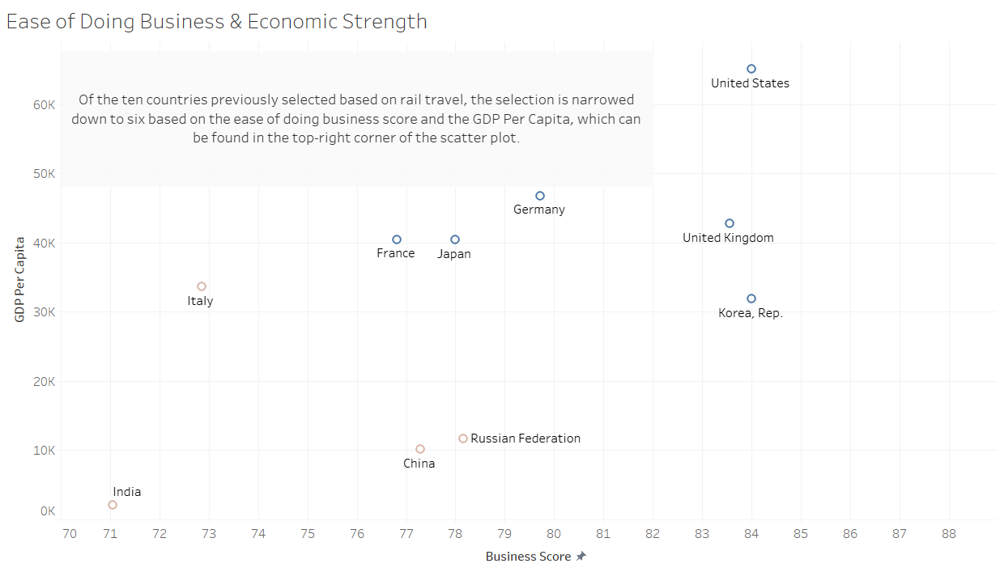

### 6. Looking for a country that has neighboring countries that are also promising.

**Insight:** France and Germany countries share a land border in top 6 countries. Among the six leading countries identified, two share a land border, presenting a strategic opportunity. This geographical proximity makes these countries particularly promising for potential successful international rail expansion.

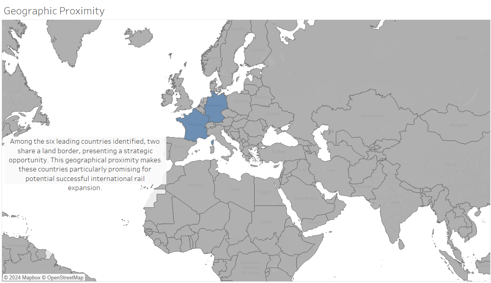

### 7. Comparing the number of incoming tourists between the two remaining countries.

**Insight:** Of the remaining two countries, France is selected, as it has roughly 5.5 times as many incoming tourists as Germany, indicating a substantially larger and more lucrative market for rail travel. This significant difference in tourist numbers suggests greater potential for customer base expansion and revenue generation in the France Rail market.

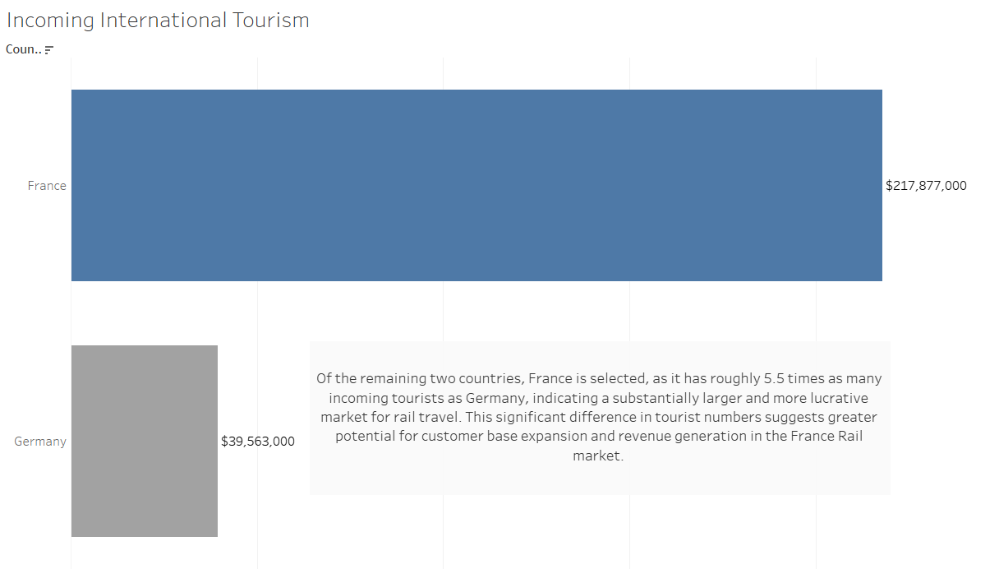

### 8. Reset all filters and adjust to show only countries with the following minimum requirements:

•Passenger Distance Traveled: 50,000 km

•	Rail Lines: 5,000 km

•	GDP Per Capita: $30,000

•	Business Score: 75

•	Incoming Tourists: 50 million

**Insight:** France

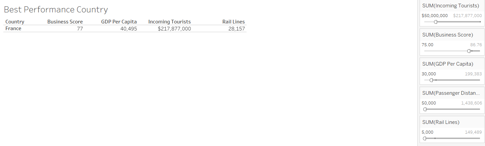

### 9. Time to start creating story.

**Insight:** After a thorough analysis, France emerges as the top pick. It stands out in passenger volume and extensive rail lines, striking a perfect balance with its robust economy and business-friendly environment. Its geographic location offers potential for international expansion, notably with promising neighboring countries. Moreover, France's exceptional tourist appeal, leading in visitor inflow, presents a lucrative market for rail travel. These combined factors make France the most promising country for establishing the new rail travel company.

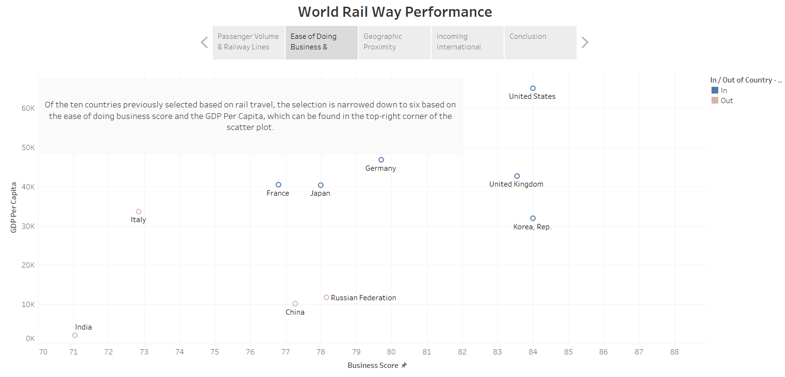

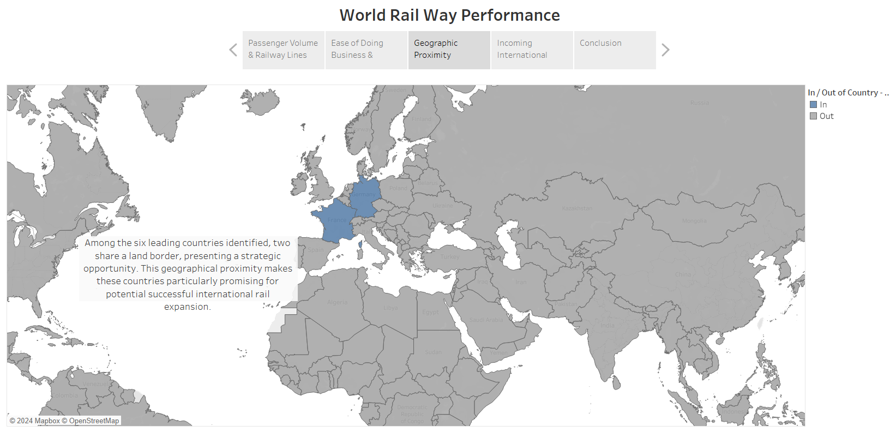

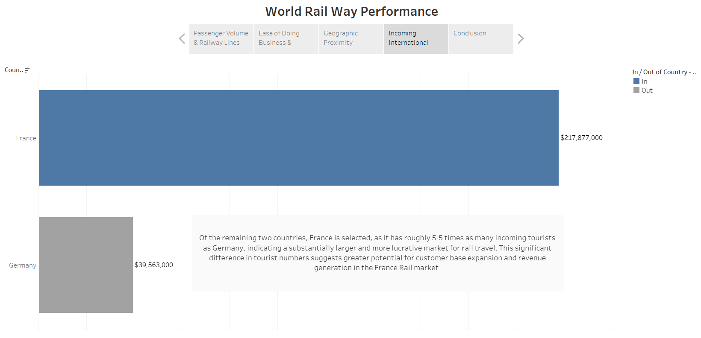

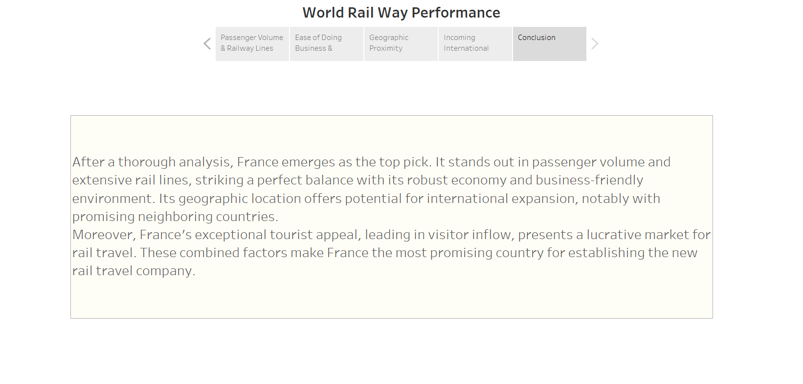

## Conclusion
The analysis provides a comprehensive overview of potential countries for launching the railway travel booking startup. By examining key metrics such as the current usage of railways, total length of railway infrastructure, GDP per capita, and the ease of doing business, the analysis identifies countries with the most favorable conditions for the business. The findings highlight the importance of robust railway infrastructure and favorable business environments as critical factors for the startup's success. Based on the data-driven evaluation, the recommended country offers a balanced combination of high railway usage, substantial infrastructure, and a conducive economic and business environment, making it an ideal choice for the startup's launch.
## Reflection
This project underscores the importance of a multi-faceted approach to market analysis, particularly when selecting a country for a startup venture. The use of comprehensive datasets and analytical tools like Tableau enables a detailed examination of various factors that can influence business success. Reflecting on the process, the ability to interpret and prioritize different metrics according to business goals was crucial. The project also highlighted the need for a strategic balance between economic indicators and operational considerations, such as infrastructure and business climate. Moving forward, the analysis could benefit from incorporating additional data sources, such as consumer preferences and competitor analysis, to further refine the recommendations.
